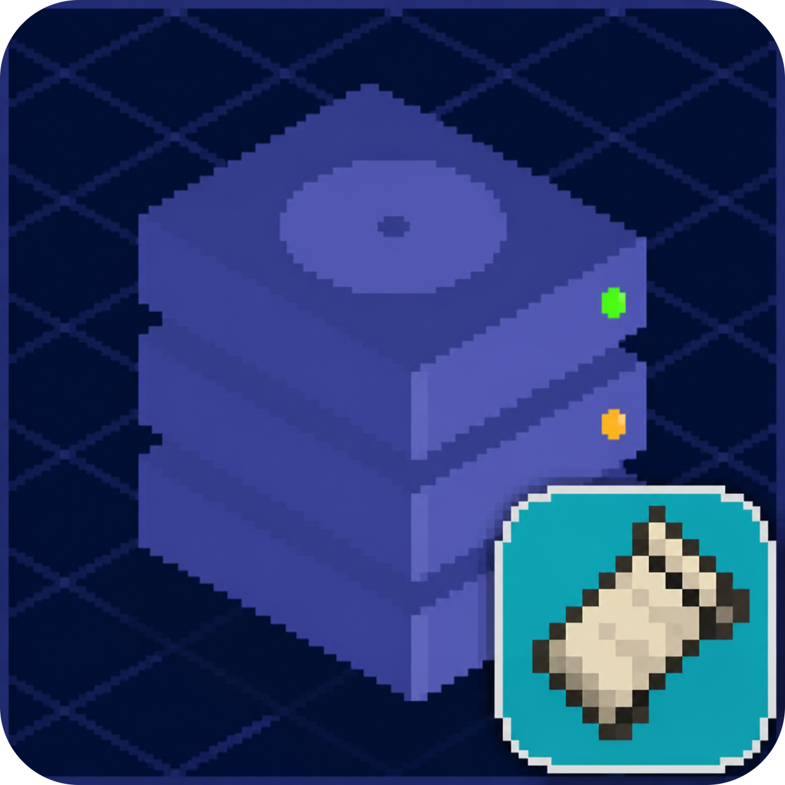

# Simple Backups Fabric

[English](README.md) · [Deutsch](README.de-DE.md) · [日本語](README.ja-JP.md) · [Português (Brasil)](README.pt-BR.md) · [Русский](README.ru-RU.md) · **Türkçe** · [简体中文](README.zh-CN.md) · [繁體中文](README.zh-TW.md)

  

[SimpleBackups](https://github.com/ChaoticTrials/SimpleBackups) modunun topluluk
tarafından sürdürülen, resmî olmayan Fabric portudur. İlgili upstream sürümünün
zamanlanmış ve elle başlatılan dünya yedekleme davranışını korurken Forge ve
NeoForge platform entegrasyonunu Fabric ile değiştirir.

> [!IMPORTANT]
> Bu proje, SimpleBackups geliştiricilerinin resmî Fabric sürümü değildir.
> Fabric portuyla ilgili sorunları upstream projeye değil, bu depoya bildirin.

## İndirmeler

Minecraft sürümünüzle tam olarak eşleşen JAR dosyasını seçin.

| Minecraft / Port | Gerekli Fabric modları | Java | İndirme / Kaynak kodu |
| --- | --- | --- | --- |
| **26.2** SimpleBackups Fabric 26.2.1 | Fabric Loader ≥ 0.19.3 Fabric API ≥ 0.158.0+26.2 Forge Config API Port ≥ 26.2.1 | Java 25+ | [JAR'ı indir](artifacts/26.2/simplebackups-fabric-26.2.1.jar) [`fabric/26.2`](https://github.com/GaBoron/SimpleBackups-Fabric/tree/fabric/26.2) |
| **26.1–26.1.2** SimpleBackups Fabric 26.1.5 | Fabric Loader ≥ 0.19.3 Fabric API ≥ 0.149.1+26.1.2 Forge Config API Port ≥ 26.1.5 | Java 25+ | [JAR'ı indir](artifacts/26.1/simplebackups-fabric-26.1.5.jar) [`fabric/26.1`](https://github.com/GaBoron/SimpleBackups-Fabric/tree/fabric/26.1) |
| **1.21.11** SimpleBackups Fabric 21.11.6 | Fabric Loader ≥ 0.19.3 Fabric API ≥ 0.141.6+1.21.11 Forge Config API Port ≥ 21.11.1 | Java 21+ | [JAR'ı indir](artifacts/1.21.11/simplebackups-fabric-21.11.6.jar) [`fabric/1.21.x`](https://github.com/GaBoron/SimpleBackups-Fabric/tree/fabric/1.21.x) |

Her kaynak kodu dalı, eşleşen SimpleBackups upstream dalından başlar ve bağımsız
olarak derlenebilir. Bu varsayılan dalda yalnızca yayımlanan derlemeler ve genel
proje bilgileri bulunur.

## Kurulum

1. Minecraft sürümünüze uygun Fabric Loader'ı kurun.
2. Uygun Fabric API ve Forge Config API Port sürümlerini kurun.
3. SimpleBackups Fabric JAR dosyasını ve bağımlılıklarını `mods` klasörüne koyun.
4. Yapılandırma dosyalarının oluşturulması için oyunu veya özel sunucuyu bir kez başlatın.

Gerekli bağımlılık sürümleri her JAR içindeki `fabric.mod.json` dosyasında
belirtilir. Gerekli bir mod eksik veya uyumsuzsa Fabric Loader açık bir bağımlılık
hatası gösterir.

## Özellikler

- Dünya çalışırken zamanlanmış yedeklemeler
- `/simplebackups backup start` komutuyla elle yedekleme
- Tam, artımlı ve diferansiyel yedekleme modları
- Mevcut SimpleBackups yapılandırma adları ve dizin yapısı
- Yedekleme zincirlerini birleştirme ve depolama sınırı yönetimi
- Özel ve tümleşik sunucu desteği
- İlgili modlar yokken güvenle yalıtılan isteğe bağlı uyumluluk entegrasyonları

Arşiv biçimleri ve gelişmiş seçenekler ilgili upstream sürümünü izler. Örneğin
1.21.11 dalı dönemine uygun yalnızca ZIP davranışını korurken, yeni sürüm dalları
eşleşen upstream kaynak kodunun desteklediği sıkıştırma biçimlerini içerir.

## Atıf ve lisans

SimpleBackups, upstream proje ve katkıda bulunanlar tarafından oluşturulmuştur.
Bu Fabric portu upstream Apache License 2.0 lisansını ve atıfları korur;
[LICENSE](LICENSE) ve [NOTICE](NOTICE) dosyalarına bakın.
